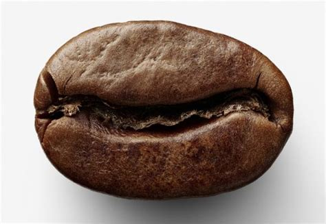

# How to make better coffee at home

## Intro

- Not tutorial
- Basics
- What you need
- Some resources
- Coffee beans are actually seeds not beans
- Chemistry experiment
- Remember: enjoy it how you like it
- Some "rules" can be broken

## Finding coffee you like

- Personal choice
- Roast date (always within 4 weeks)
- Processing:
    - Natural - fruitier cup 
    - Washed - more balanced
    - ...
- Roast level:
    - Lighter - Fruitier
    - Darker - Chocolatey

## Finding coffee you like

- Area/Origin:
    - Ethiopia (So much to choose from)
    - Malawi
    - Kenya
    - Tanzania
    - Uganda
    - Brazil
    - Columbia
    - Nicaragua
    - El Salvador

## Finding coffee you like

- Varietal:
    - Bourbon
    - SL28
    - Basically the type of coffee
- Cape Coffee Beans (Life saver)
    - They have categories for different methods and flavour descriptions

## Finding coffee you like

- Coffee Shops
    - The Grind (Here in Melrose JHB)
    - Father (Rosebank/Braamfontein JHB)
    - Doubleshot (Braamfontein JHB)
    - Origin (Maboneng JHB/CPT)
    - Naked (Morningside JHB)
    - Legado (CPT)
    - Rosetta (CPT)
    - Quaffee (CPT)
    - Portland Project (CPT)

## Basics

- Water (usuallay warm)
- Coffee (ground)
- Time
- Agitation
- Pressure (sometimes)
- Crushed roasted seed broth :)

### Water

- 98.75% of the cup
- Really important
- Clean filtered water
- Evian

### Coffee

- What coffee?
- Freshly roasted (nothing older than 4 weeks).
- Roast date not use by date
- Whole bean coffee (not ground if possible)

### Time

- How long the cofee and water is in contact
- The more time the more you extract
- More on this later

### Agitation

- Stirring
- Create turbulance in slurry
- Increses extraction

### Temperature

- At what temperature the water you are brewing with is
- Constant temperature
- Not that important to start out with

### Pressure

- Not always applicable (immersion brews, gravity)
- Aeropress, Espresso

## Grinders

- Grinder grinds coffe into smaller particles
- Increases surface area of coffee for extraction
- Uniform distribution
- More uniform grind = more even extraction
- Bean density: how hard or compact the bean is

### Blade

- Use it for spices instead
- Very difficult or impossible to get the same grind size twice
- Fines & boulders
- Just don't (Let your roaster grind for you)

### Conical Burr

- Steel vs Ceramic
- Can be cheap or very expensive
- Preferred choice
- Hario, Porlex, Severin problem

### Flat Burr

- More geared toward espresso
- EK43

### Grind Quality Scale

1. Fresh beans ground on demand (no blades but burrs)
1. Fresh Pre-ground
1. Fresh beans with blade grinder
1. Stale Beans
1. Stale Pre-ground

## Extraction

- Overextraction - Extracting the bad bits of the bean
- Underextraction - Not extracting all of the good stuff
- Under and over extracted (crap grinder) - Usually get this with the Hario Skerton Grinder
- Hence why a good grinder is necessary

## Variable relationships

- More time => Coarser grind
- Less time => Finer grind
- More time => Less agitation
- Less time => More agitation
- More time => Less pressure
- Less time => More pressure
- More time => Lower temperature
- Less Time => Higher temperature

Notes:
- In terms of time as that is something that we can easily control
- Cant always choose grind size

## Ratios

- Coffee:Water
- 1:11 (strong) -> 1:18 (weak) - personal preference
- I prefer the 1:15 -> 1: 16 (pour over)
- One gram of coffee has big impact on ratio

## Coffee at home

- Round up of different price points of coffee equipment

### Entry Level

- *French Press (R399)
- Hario Slim Grinder (R599)
- *Scale (you need one) (R249)
- R1247
- Phone timer
- Tutorial by James Hoffman

Notes:
- Scale is important to reproduce great cups of coffee
- Pros: 
    - cheap 
    - Not that easy to stuff up
    - Most people have one already
    - Can make cold brew
    - Can make more than one cup
- Cons: 
    - Gritty cup (does not have to be)
    - Not easy to clean

### Intermediate

- *Aeropress (R689)
- Porlex grinder (R1425)
- Scale (you really need one) (R249)
- R2363
- Tutorial by anyone on youtube
- Aeroprecipe app

Notes:
- Pros:
    - Not that expensive
    - All in one package
    - Great for traveling/camping
    - Strong does not break easily
    - Versatile (attacahments and styles)
    - Temperature play
    - Easy to clean
- Cons:
    - Makes one cup only
    - Attention

### Advanced

- *Pour over (Hario V60(R129), Chemex(R799), Clever dripper (R399), Melitta(R119)),
- *Pouring kettel (R799)
- Server/Vessel (R399)
- Electric coffee grinder(R1599)
- Scale (why dont you have one yet?)(R249)
- R3175
- Tutorial by Scott Rao

Notes:
- Pros:
    - Clean great cups of coffee
    - Looks awesome
    - Easyish to clean
    - Different styles
    - Good for every day
    - Can make more than one cup of coffee
- Cons:
    - Expensive
    - High skill level

### Insane

- Copper V60 (R1099)
- Copper Hario Kettel (R2499)
- Acaia Pearl Scale (R2259)
- Baratza Sette 270Wi [Electric] (R10999) or
- Commandante C40 Mk3 [Manual] (R3695)

## How to start

- Off the boil water (no you cant burn the coffee with boiling water (Roaster))
- Get your ratio
- Change 1 variable at a time
- Time and Grind size is usually easy to change depending on method

## Pour Over

- Scott Rao method kind of
- 30g Cofee ground to sugar consistency (bit smaller)
- 90g bloom water for 40 seconds
- 480g single pour in circles slowly
- Swirl and leave
- 3:30 time sometimes (bean density makes a difference to the extraction)

## Aeropress

- Don't know where I got it but it works for me
- Inverted method
- 16g Coffee ground to table salt
- 50g blooom water for 30 seconds with a few stirs (depending on bean density)
- 250g water all in create turbulance
- Flip & start pressing at 1:15 finish at 2:00 max (depending on agitation turbulance & bean density)

## Clenliness

- Rancid coffee oils on equipment
- Wash equipment after 250g bears (1 bag)
- Rinse equipment after use
- Brush grinder out between bags of beans

## References

### Interesting info & reads

- [Processing](https://www.darkmattercoffee.com/blogs/news/117882500-coffee-processing-and-what-it-means)
- [Regions](https://drinks.seriouseats.com/2013/06/coffee-flavor-profiles-major-growing-regions-guatemala-kenya-brazil-ethiopia.html)
- [Varieties of coffee](https://vimeo.com/41428743)
- [Some coffee basics](https://www.iflscience.com/editors-blog/youve-been-making-coffee-wrong-your-entire-life/all/)
- [French press tutorial](https://www.youtube.com/watch?v=st571DYYTR8)
- [V60 Tutorial](https://www.youtube.com/watch?v=c0Qe_ASxfNM&t=573s)

### Shops

- [Cape Coffee Beans](https://capecoffeebeans.co.za)
- [The Brewstery](https://thebrewstery.com/)
- [Wake Up Brew](https://wakeup-brew.co.za/)
- [Yuppiechef](https://www.yuppiechef.com)

### Equipment

- [French Press](https://capecoffeebeans.co.za/collections/coffee-makers/products/hario-cafe-press-slim-s?variant=44490370628)
- [Hario Slim Mill](https://capecoffeebeans.co.za/collections/coffee-grinders/products/hario-mini-mill-manual-coffee-grinder?variant=816670925)
- [Scale](https://www.yuppiechef.com/mellerware.htm?id=15590&name=Mellerware-Saxony-Kitchen-Scale)

### Equipment

- [Aeropress](https://capecoffeebeans.co.za/collections/coffee-makers/products/aeropress-coffee-maker?variant=593064405)
- [Porlex Mini](https://capecoffeebeans.co.za/collections/coffee-grinders/products/porlex-mini-hand-mill-coffee-grinder?variant=683271557)
- [Melitta](https://www.yuppiechef.com/melitta.htm?id=22187&name=Melitta-Aromafilter-102-6-Cup-Pourover-Coffee-Maker)
- [Hario V60](https://capecoffeebeans.co.za/collections/coffee-makers/products/hario-v60-pour-over-coffee-dripper)
- [Chemex](https://capecoffeebeans.co.za/collections/coffee-makers/products/chemex-pour-over-coffee-maker)
- [Clever Dripper](https://capecoffeebeans.co.za/collections/coffee-makers/products/abid-clever-coffee-dripper?variant=969138780)
- [Hario Kettle](https://capecoffeebeans.co.za/collections/kettles/products/hario-v60-buono-drip-kettle?variant=36506611396)

### Equipment

- [Hario Server/Vessel](https://capecoffeebeans.co.za/collections/hario/products/hario-v60-range-server)
- [Severin Coffee Grinder (electric)](https://capecoffeebeans.co.za/collections/coffee-making-equipment/products/severin-conical-burr-electric-coffee-grinder?variant=846589573)
- [Copper V60](https://capecoffeebeans.co.za/collections/coffee-makers/products/hario-v60-pour-over-coffee-dripper-copper)
- [Copper Hario Kettel](https://capecoffeebeans.co.za/collections/kettles/products/hario-v60-buono-drip-kettle-copper)
- [Acaia Pearl Bluetooth Scale](https://capecoffeebeans.co.za/collections/coffee-scales/products/acaia-pearl-digital-bluetooth-coffee-scale)

### Euqipment

- [Baratza Sette Grinder](https://capecoffeebeans.co.za/collections/coffee-grinders/products/baratza-sette-270-series-conical-burr-coffee-grinder?variant=9475592454191)
- [Commandante C40](https://onlinecoffeeshop.co.za/shop/coffee-grinders/comandante-c40-nitro-blade-bamboo-hand-coffee-grinder/)
